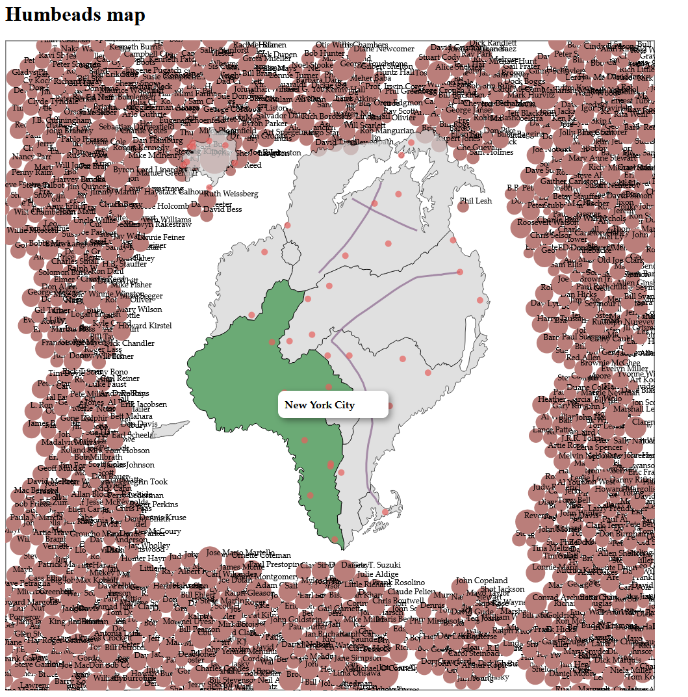

# Humbead's Map and American Folk Music of 1960s

Humbead’s Revised Map reimagines the globe from the perspective of the American West Coast folk scene and emerging hippie counterculture. We attempted to recreate the map in a digital form and explore whether the digital map can add new aspects to the storytelling.

## Quick-start

Download the repo and run the visualization

```
git clone https://github.com/submal/Humbeads-map-project.git
cd Humbeads-map-project
python -m http.server 8000
```

And navigate to http://localhost:8000 for the user interface. 

<p align="center">
  
</p>